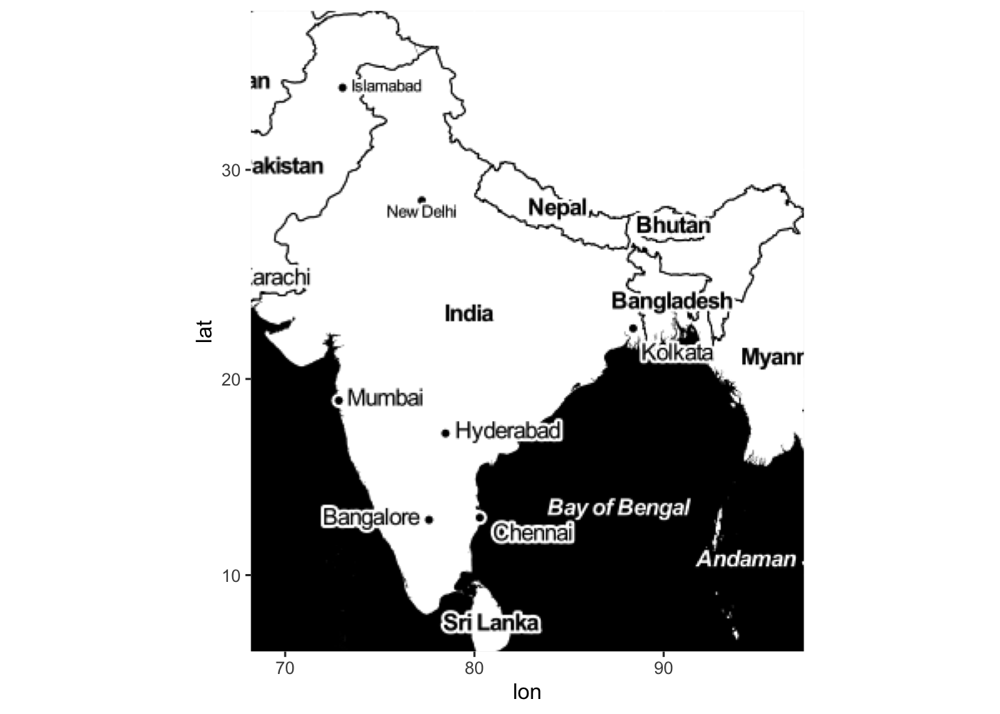

Mapping Indian Data
================
Using geo-spatial packages in R

### Get Data

    ## OGR data source with driver: ESRI Shapefile 
    ## Source: "/Users/parthkhare/Desktop/MSCAPP Quarters/Quarter 4/Q4 Hydropolitics/Seminal Paper/India groundwater/Ind2016_gw_sites.shp", layer: "Ind2016_gw_sites"
    ## with 20683 features
    ## It has 24 fields

## Mapping India: Fixing Span

``` r
# Fix Centroid for map Scale
india_centroid <- c(68.18625, 6, 97.41529, 37)                 # Optimal

# Map Type I: Groundwater
go_bw_sat <- get_map(location=india_centroid, color="bw", zoom=4, maptype="satellite")
```

    ## Bounding box given to Google - spatial extent only approximate.

    ## Source : https://maps.googleapis.com/maps/api/staticmap?center=21.5,82.80077&zoom=4&size=640x640&scale=2&maptype=satellite&language=en-EN&key=xxx-AnFqj3YWzXSPo

``` r
fix_crop_gw <- ggmap(go_bw_sat, extent="device",legend="bottomright", size=c(500,600))
fix_crop_gw + geom_point(aes(x=lond, y=latd, colour=Jan_s1), 
                         data=gw16, alpha = .6,size = 0.15) +
              scale_color_gradient2(low = muted("red"), high = muted("blue"), 
                                    mid = muted("lightblue")) +
              ggtitle("Groundwater Stations in India")
```


``` r
# Map Type II: Protests in India 2019:2020 (ACLED)
go_ter <- get_map(location=india_centroid, zoom=4, maptype = "terrain")
```

    ## Bounding box given to Google - spatial extent only approximate.

    ## Source : https://maps.googleapis.com/maps/api/staticmap?center=21.5,82.80077&zoom=4&size=640x640&scale=2&maptype=terrain&language=en-EN&key=xxx-AnFqj3YWzXSPo

``` r
fix_crop_tr <- ggmap(go_ter, extent="device",legend="bottomright", size=c(500,600))
fix_crop_tr + geom_point(aes(x=longitude, y=latitude),data=pro, 
                         color=muted("red"), alpha = .6,size = 0.15) +
              scale_color_gradient2(low = muted("red"), high = muted("blue"), 
                                    mid = muted("lightblue")) +
              ggtitle("Protests in India 2019:2020")
```


``` r
# Rainfall
st_ton <- get_map(location=india_centroid, zoom=4, maptype="toner", 
                     source="stamen")
```

    ## Map tiles by Stamen Design, under CC BY 3.0. Data by OpenStreetMap, under ODbL.

``` r
fix_crop_st <- ggmap(st_ton, extent="device",legend="bottomright", size=c(500,600))
fix_crop_st + geom_point(aes(x=lg, y=lt),data=r2010, 
                         color=muted("red"), alpha = .6,size = 0.15) +
              scale_color_gradient2(low = muted("red"), high = muted("blue"), 
                                    mid = muted("lightblue")) +
              ggtitle("Rainfall in 2010")
```


## Display All Map Types



<!-- ## Demographic Dividend: 2017-18 -->

<!-- Youth Population from Atlas of Human Settlements [Gridded Population of India (GHSL)] -->

<!-- ```{r, echo=F, message=F} -->

<!-- var <- 'ypop' -->

<!-- qpal <- colorQuantile("RdYlBu", domain = sr$var, n = 4) -->

<!-- leaflet(sr) %>% -->

<!--   addProviderTiles(providers$CartoDB.DarkMatter) %>% -->

<!--   addPolygons(color = "#B0B0B0", weight = 1, smoothFactor = 0.5, -->

<!--               opacity = 0.2, fillOpacity = 0.8, -->

<!--               fillColor = ~qpal(get(var)), -->

<!--               highlightOptions = highlightOptions(color = "white", weight = 2, -->

<!--                                                    bringToFront = TRUE)) %>% -->

<!--    addLegend("bottomright", pal = qpal, values = ~get(var), -->

<!--             opacity = 0.3, title = "Applicants") -->

<!-- ``` -->
